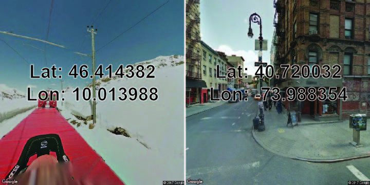
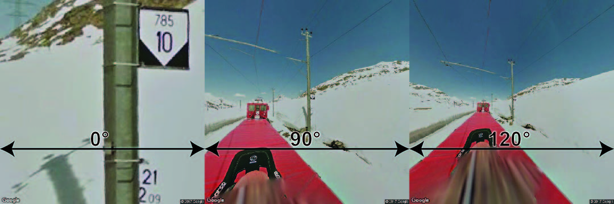

google_streetview
=================

.. toctree::
   :maxdepth: 2

| Richard Wen
| rrwen.dev@gmail.com

A command line tool and module for Google Street View Image API.

::
  
  google_streetview -h
  google_streetview --location=46.414382,10.013988
  google_streetview --pano=vPnURflnc8AZu5NMLYRddw

Install
-------

1. Install `Python <https://www.python.org/downloads/>`__
2. Install `google_streetview <https://pypi.python.org/pypi/google_streetview>`__ via ``pip``

::
  
  pip install google_streetview

Setup
-----

* A `Google API developer key <https://developers.google.com/api-client-library/python/auth/api-keys>`__ is required to use this package
* A `Gmail <https://www.google.com/gmail>`__ account will also be required to create and access the developer key
* When asked to sign in, use your Gmail account for access
* Please note that usage of the Google Street View API may require a `billing plan <https://developers.google.com/maps/documentation/streetview/usage-and-billing>`__

*Note: Instructions and links were written on March 5, 2019, and are subject to change depending on Google's website and API.*

Google API
**********

An `API developer key <https://developers.google.com/api-client-library/python/auth/api-keys>`__ for the `Google Application Programming Interface (API) <https://developers.google.com/api-client-library/python/>`__ can be setup with the following instructions:

1. Enable `Google Street View Image API <https://console.developers.google.com/apis/api/street-view-image-backend.googleapis.com>`__
2. Go to `Google API Console Credentials <https://console.developers.google.com/apis/credentials>`__
3. Click **Create Credentials -> API Key**
4. Set ``key`` by replacing "your_dev_key" with the **API Key**

::
  
  google_streetview -s key="your_dev_key"

Usage
-----

For help in the console, use::
  
  google_streetview -h
  
Please ensure that the `Setup`_ section was completed::
  
  google_streetview -s key="your_dev_key"

Image Search
************
    
Get street view image using the location argument ``--location`` and providing ``<latitude>,<longitude>`` values::
  
  google_streetview --location=46.414382,10.013988
  
.. image:: img/location_example.jpg
  
Get street view image using the panorama id argument ``--pano``::
  
  google_streetview --pano=vPnURflnc8AZu5NMLYRddw
  
.. image:: img/pano_example.jpg

Multiple locations and panorama ids can be given by separating with ``;``::
  
  google_streetview --location=46.414382,10.013988;40.720032,-73.988354
  google_streetview --pano=vPnURflnc8AZu5NMLYRddw;A1v2IdX_6HKnIQa2SPyyAg
  

  
Adjust size of the images up to 640 by 640 pixels with the ``--size`` argument and providing ``<width>x<height>`` values (the default is ``640x640``)::

  google_streetview --location=46.414382,10.013988;40.720032,-73.988354 --size=200x200

.. image:: img/size_example.jpg
  
Adjust the heading of the camera with the ``--heading`` argument, where 0 and 360 are north, 90 is east, 180 is south, and 270 is west::
  
  google_streetview --location=46.414382,10.013988 --heading=0
  google_streetview --location=46.414382,10.013988 --heading=90
  google_streetview --location=46.414382,10.013988 --heading=180
  google_streetview --location=46.414382,10.013988 --heading=270
  google_streetview --location=46.414382,10.013988 --heading=360

.. image:: img/heading_example.jpg

Adjust the image's horizontal field of view with the ``--fov`` argument, which represents zoom values of up to 120 (the default is ``90``)::

  google_streetview --location=46.414382,10.013988 --fov=0
  google_streetview --location=46.414382,10.013988 --fov=90
  google_streetview --location=46.414382,10.013988 --fov=120

Adjust the camera's up and down angle with the ``--pitch`` argument, where positive values up to 90 degrees indicate straight up and negative values down to -90 indicate straight down (the default is ``0``::
  
  google_streetview --location=46.414382,10.013988 --pitch=0
  google_streetview --location=46.414382,10.013988 --pitch=90
  google_streetview --location=46.414382,10.013988 --pitch=-90

.. image:: img/pitch_example.jpg

Save Results
************

Download street view images to "downloads" folder with the ``--save_downloads`` argument::
  
  google_streetview --location=46.414382,10.013988;40.720032,-73.988354 --save_downloads=downloads
  
.. image:: img/download_example.jpg
  
Save metadata::
  
  google_streetview --location=46.414382,10.013988 --save_metadata=metadata.json
  google_streetview --pano=vPnURflnc8AZu5NMLYRddw --save_metadata=metadata.json

Save URL links::
  
  google_streetview --location=46.414382,10.013988 --save_links=links.txt
  google_streetview --pano=vPnURflnc8AZu5NMLYRdd --save_links=links.txt

Save links and metadata::
  
  google_streetview --location=46.414382,10.013988 --save_links=links.txt --save_metadata=metadata.json
  google_streetview --pano=vPnURflnc8AZu5NMLYRdd --save_links=links.txt --save_metadata=metadata.json

Multiple Arguments
******************

Multiple arguments can be specified by separating parameter values with the semi-colon ``;`` seen in the ``heading`` parameter::

  google_streetview --location=46.414382,10.013988 --heading=0;90;180;270
  
.. image:: img/heading_example.jpg

Download the 360 panorama imagery for 2 locations using a field of vision ``fov`` of 90, which provides 8 images (90 degree from ``fov`` up to 270 degrees as 0 and 360 refer to the same ``heading``)::

  google_streetview --location=46.414382,10.013988;40.720032,-73.988354 --fov=90 --heading=0;90;180;270
  
.. image:: img/panorama_example.jpg
  
Default Arguments
*****************

Default arguments persist even after the console is closed. Defaults enable user customization of the google_streetview command without a long list of arguments every call.  
  
View the defaults::
  
  google_streetview -v

Increase number of results previewed to ``20``::

  google_streetview -s option_preview=20
  
Turn off preview of results::

  google_streetview -s option_silent=True
  
Set the ``fov`` argument to default to ``45``::

  google_streetview -s fov=45
  
Set the ``heading`` argument to default to ``0`` images::
  
  google_streetview -s heading=0

Set to save a text file named ``links.txt`` with result links whenever used::
  
  google_streetview -s save_links=links.txt

Remove default arguments::

  search_result -r option_preview
  google_streetview -r option_silent
  google_streetview -r fov
  google_streetview -r heading
  google_streetview -r save_links
  
Reset the defaults::
  
  google_streetview -d

After resetting defaults, the developer key will have to be set again::
  
  google_streetview -s key="your_dev_key"

Additional Arguments
********************

A number of optional arguments defined using ``--`` are not shown when using ``google_streetview -h``. These can be used with the same names as the paramters passed to `Google's Street View Image API <https://developers.google.com/maps/documentation/streetview/intro>`__::

  google_streetview -a

For example, the digital signature for billing can be set by argument ``signature`` which is a named paramter in the API::
  
  google_streetview cat --signature="your_signature"
  
Module Import
*************

The `google_streetview <https://pypi.python.org/pypi/search-google>`__ package may also be used as a `Python module <https://docs.python.org/2/tutorial/modules.html>`__::
  
  # Import google_streetview for the api module
  import google_streetview.api
  
  # Define parameters for street view api
  params = [{
    'size': '600x300', # max 640x640 pixels
    'location': '46.414382,10.013988',
    'heading': '151.78',
    'pitch': '-0.76',
    'key': 'your_dev_key'
  }]
  
  # Create a results object
  results = google_streetview.api.results(params)
  
  # Download images to directory 'downloads'
  results.download_links('downloads')

For more details on module usage, see the examples in `api`_ for single argument queries and `helpers.api_list`_ for multiple argument queries.
  
Modules
-------

api
***

.. automodule:: api
   :members:

cli
***

.. autofunction:: cli.run

helpers
*******

.. autofunction:: helpers.api_list
   